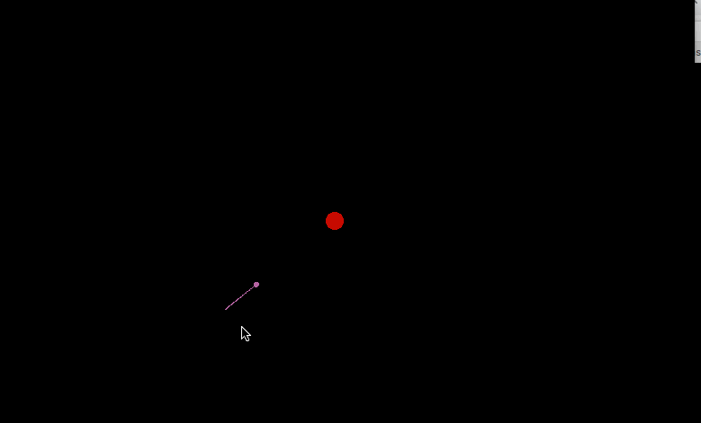

A small game in C++/OpenGL

pess s and drag the mouse on the screen to set the thrust force of the placed planet and try to make it orbit the
sun. You can put any number of planet to build your own solar system.

## Prerequistes
According to your OS, install appropriate library for OpenGL and OpenGL utility.

## INSTALL
`make`

You may need to edit the Makefile.

